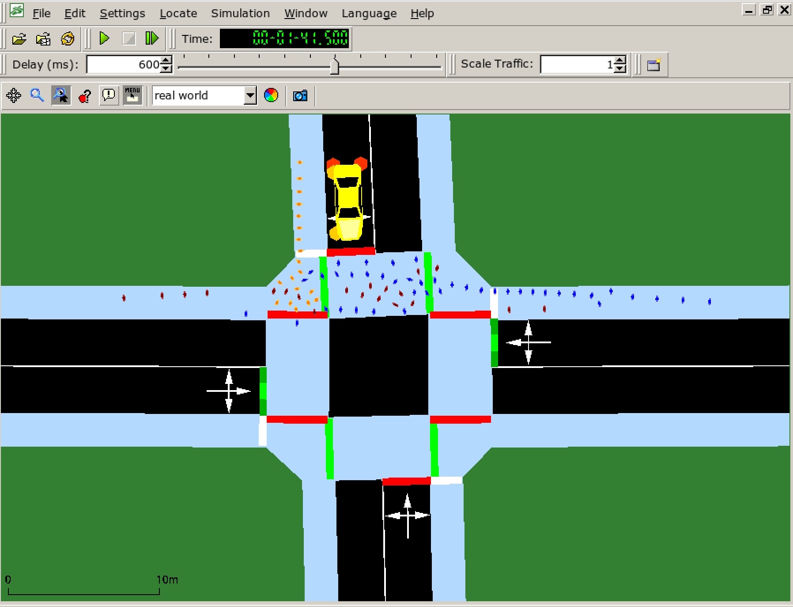
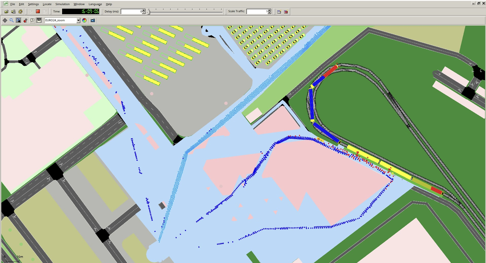
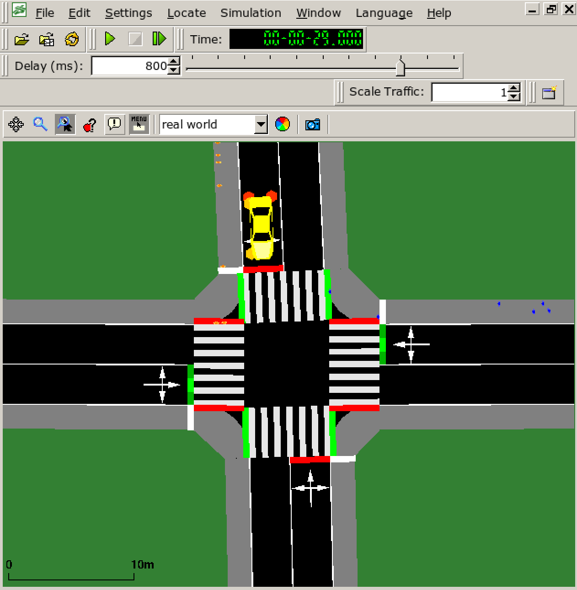
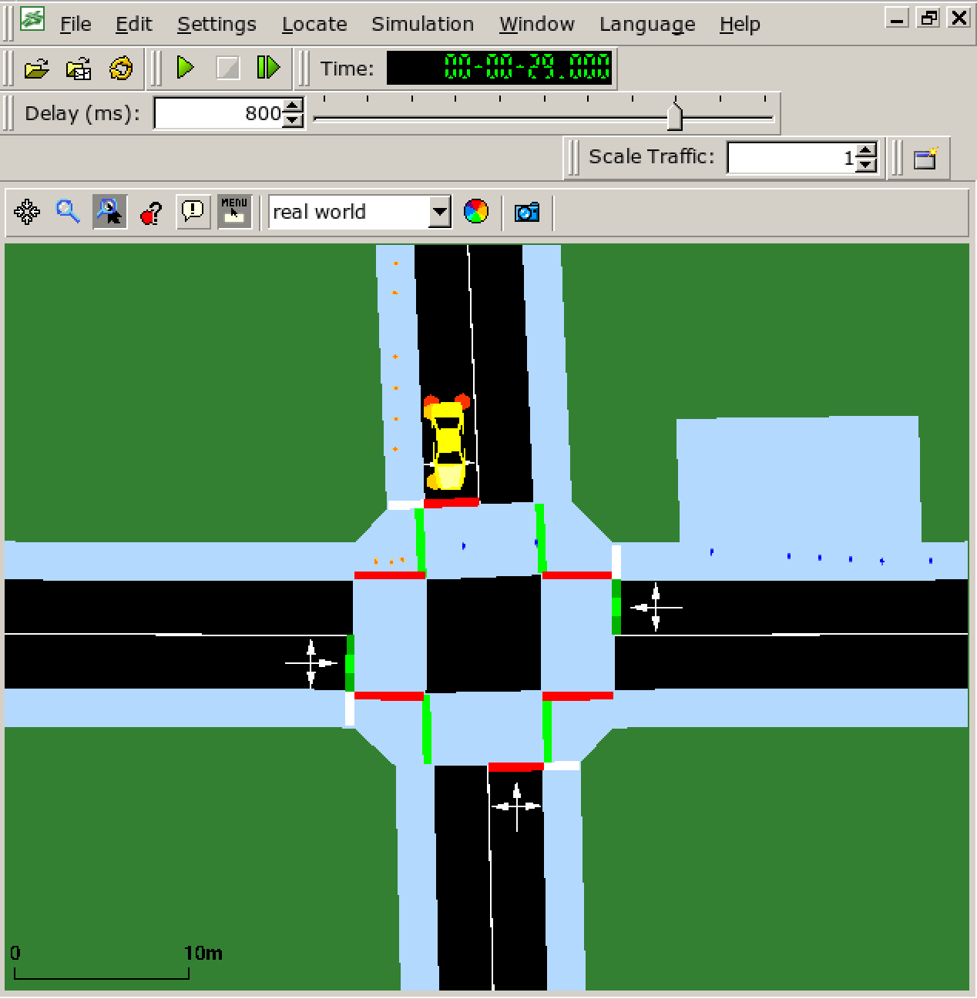

# Introduction

When analyzing the movement of crowds in urban areas — such as at train stations or during the arrival and departure phases of major events — it is essential to consider traffic-related aspects.
Factors like the frequency and capacity of trains, the positioning of train doors, and the interaction between cars and pedestrians at intersections significantly influence the dynamics of pedestrians.
To investigate such scenarios holistically, including both traffic and pedestrian dynamics, basic functionalities of *JuPedSim* have been integrated into *Eclipse SUMO*.

The Juelich Pedestrian Simulator ([JuPedSim](https://www.jupedsim.org/)) is an open-source tool for simulating pedestrian dynamics offering different models for the interaction of pedestrians with their neighbors in a 2D environment. The simulations results provide valuable insights into crowd dynamics usually evaluated by the occurrence of jam, local densities and speed. 

For the interaction of pedestrians with their surroundings (neighbors, obstacles, walls, ...) several microscopic [models](https://www.jupedsim.org/stable/pedestrian_models/) are available in JuPedSim. These microscopic models allow to reproduce phenomena in large crowds such as arching in front of bottlenecks and lane formation in bi-directional streams. 

*Example of a simulation with JuPedSim for a bottleneck scenario. Arching occurs.*

The movement of the agents is restricted to 2D space which is referred to as *walkable area*. The [walkable area](https://www.jupedsim.org/stable/concepts/geometry.html) is a closed polygon with holes respresenting obstacles such as trees, pillars or stalls. Agents can move in all directions within the area. This results in a high computational effort, which increases with the number of agents (and thus neighbors) and the size of the walkable area, as wayfinding becomes more complex. Due to its underlying model, JuPedSim operates with a higher temporal resolution than SUMO - typically 0.01 seconds — which makes it the runtime-limiting factor in coupled simulation scenarios.

For [route planning](https://www.jupedsim.org/stable/concepts/routing.html) a journey must be defined for each agent. The journey can be a composition of various stages, e.g. exits as a final goal, waypoints that must be passed or waiting positions that are organized as queues or sets. Journeys can be shared by several agents but also multiple journeys can be defined within one simulation scenario.

JuPedSim is provided as a Python package with a C++ core behind and a C-API that is used by SUMO. The *SUMO-JuPedSim* simulation loop starts with *JuPedSim* independently updating pedestrian positions 

## What is it for?

The integration is particularly useful in scenarios where crowd and traffic dynamics interact, such as:

* Scenarios involving congestion-prone pedestrian facilities that influence urban traffic flow or vice versa.
* Crowded public spaces with connections to vehicular transport systems, e.g., train stations.
* Modeling intermodal arrival and departure traffic during major public events.

In summary: The *SUMO-JuPedSim* integration becomes especially relevant when crowd dynamics play a significant role in traffic simulation scenarios.

*Simulation snapshot for a crossing scenario with multidirectional pedestrian streams that interact with cars.*

*Simulation snapshot for the arrival processes to a major event considering different modes of transport (train, car, bus, by foot).*

## Configuration Possibilities

Following functionalities for configuring a *JuPedSim* simulation in *SUMO* are available:

* Precise definition of a 2D **walkable area** that is accessible for *JuPedSim* agents including obstacles (such as barriers, trees and signs) either via the DXF import tool or by drawing in netedit
* Conversion of pedestrian facilities included in a *SUMO* network to a 2D walkable area
* Configuration of **model parameters** for the `CollisionFreeSpeedModel`
* Configuration or temporary adjustment of pedestrian speed in defined areas

#### NOTE
Even though it is in theory possible to use other *JuPedSim* models, only the `CollisionFreeSpeedModel` has been tested extensively so far.

* Configuration of **sources** in which *JuPedSim* agents are spawned
* Configuration of coupled **transfer** points where agents switch from a vehicle (bus, cars or train) to walking or vice versa
* Configuration of flexible **routing** (journeys) for agents consisting of intermediate waypoints, distribution waypoints and exits
* Configuration of **vanishing zones** at exits to model ticket control at venues according to the capacity of an entrance system
* **Interaction of cars** and pedestrians in an ordered manner (stopping by management measures)

## Technical Background
The *SUMO-JuPedSim* simulation loop starts with *JuPedSim* independently updating pedestrian positions over multiple time steps independent of *SUMO*’s simulation cycle, as the temporal resolution for the pedestrian model is significantly higher.
Once positions are calculated, they are mapped to *SUMO*’s network in the following way: Pedestrians on regular *SUMO* lanes (part of the defined network) are assigned to their corresponding edges, while those outside *SUMO*’s standard network (e.g. inside additionally defined walkable areas) are assigned to the nearest edge for technical consistency.
These edges primarily serve as reference points for waypoints (start, end, or intermediate goals).
After mapping, additional adjustments are made, such as modifying pedestrian speeds or removing agents who reach their destinations or enter predefined *vanishing zones*.

*Crossing simulation with SUMO striping model.*

!

*Crossing simulation with SUMO-JuPedSim.*

*Crossing simulation with SUMO-JuPedSim and an additional walkable area.*

To define a journey for the *JuPedSim* agents in *SUMO*, a walk (or trip) must be configured by connecting the corresponding edges in the *SUMO* network (waypoints in *JuPedSim*).
For dynamic rerouting, the system allows agents to adapt their routes during simulation.
This is particularly useful for scenarios like crowd management, where pedestrians might need to choose between exits (e.g. different exits at platform).
Rerouters — placed on *SUMO* edges — define probabilistic next-waypoint options, enabling flexible decision-making.
While these rerouters must be edge-based, they don’t require integration into *SUMO*’s interconnected road network.

Interactions between cars and pedestrians occur in two contexts.
First, in shared spaces (e.g. roads or parking lots), cars treat pedestrians as slow-moving obstacles and adjust their behavior accordingly, though pedestrians currently do not react to vehicles (a feature planned for future implementation).
Second, at crosswalks or traffic lights, *SUMO*’s “link” concept (which opens or closes paths based on signals) translates into active or inactive waiting positions in *JuPedSim*.
Pedestrians approach these crossings but only halt if the link is closed.
However, at the time of writing, these waiting positions are static and need to be refined together with better modeling of the waiting behavior.

## Future Perspective

*SUMO-JuPedSim* is being continuously developed based on new use cases and emerging research questions.
Our planned developments include the conversion of the striping model into the *JuPedSim* model within defined areas to enable efficient large-scale traffic simulation including small-scale *JuPedSim* simulations.
Besides, we are actively working on improving the waiting behavior of pedestrians, which is particularly relevant in scenarios such as waiting at traffic lights or at train stations before boarding.
To support this, an advanced *JuPedSim* model for waiting is being developed and is planned to be integrated into *SUMO*.

With the coupled simulators, we have established an open-source framework for advanced modeling in shared spaces, where interactions between different traffic participants become especially complex.
