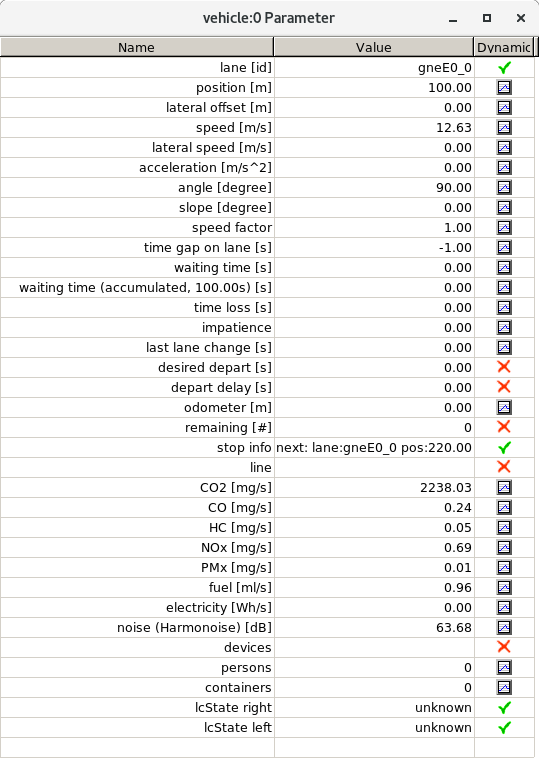

# From 30.000 feet

**sumo-gui** is basically the same application as
[sumo](sumo.md), just extended by a graphical user interface.

- **Purpose:** Simulates a defined scenario
- **System:** portable (Linux/Windows is tested); opens a window
- **Input (mandatory):** A SUMO-configuration file (see [sumo](sumo.md))
- **Output:** sumo-gui generates the same output as [sumo](sumo.md)
- **Programming Language:** C++

# Usage Description


*Initial appearance of sumo-gui; may differ from what you see*

Being a window-based application, sumo-gui is started by a double click
with the left mouse button on Windows, on Linux probably with a single
click. After this, an empty window should show up, similar to the one
shown in the image.

Using either the "File-\>Open Simulation..." menu entry or by using the
"open"-icon (),
you should be able to load an existing [sumo](sumo.md)
[configuration
file](Basics/Using_the_Command_Line_Applications.md#configuration_files),
if it has the proper [extension](Other/File_Extensions.md)
*".sumocfg"*. If the [sumo](sumo.md) [configuration
file](Basics/Using_the_Command_Line_Applications.md#configuration_files)
is erroneous, the errors are reported, otherwise your network referenced
within the configuration file should be shown. Now you can start to
simulate by pressing the "play" button (). The simulation works as if being started on the
command line. The simulation can be halted using the "stop" button
() and continued by pressing
the "play" button again. When stopped, also single steps may be
performed by pressing the "single step" button
().

If the simulation is running, the current simulation second is shown in
the "digital digits" field, right to "Time:"
(). By clicking on the word "Time:", the
display can be toggled between showing `<seconds>` and `<hour:minute:seconds>`.

Next to the time display is the delay control
(). This allows you to
slow down the simulation by waiting for the given number of milliseconds
between simulation steps.

!!! note
    By default the *delay* is set to 0. This can result in a simulation that runs too fast to see any vehicles. Increase the delay value if this happens.

Besides loading simulation configurations, it is also possible to load
networks by using either the "File-\>Open Network..." menu entry or by
using the "open network"-icon (). Please note, that normally
**sumo-gui** assumes networks have the
[extension](Other/File_Extensions.md) *".net.xml"*, but also
accepts other extensions.

Both, the loaded simulation or the loaded network may be reloaded using
the "reload" button ()
or the menu entry "File-\>Reload".

If a network or a simulation are loaded, the navigation through the
network is possible with the mouse or with the keyboard. One can drag
the network with the left mouse button pressed into all directions and
zoom either by using the mouse wheel or by pressing the right mouse
button and moving the mouse up and down. For fine grained zooming (half
zoom speed) press the "Control" key while using the mouse wheel, for
double speed use "Shift".

# Interaction with the View

## Basic Navigation


As soon as a network is displayed, one can interact with the view.
Pressing the left mouse button within the view and moving the mouse with
the button pressed, will shift the network. Moving the mouse up and down
while pressing the right mouse button changes the zoom of the network.
It is also possible to change the zoom by using the mouse wheel (holding
*<SHIFT\>* increases the zooming speed and holding *<CTRL\>* lowers it).
Zooming is either focused on the center of the screen or on the cursor
position. The zoom style can be selected with the
 button.

You can also control which part of the network is visible by directly
setting the network coordinates which shall be at the center of the
screen along with the zoom (given a value of 100 the whole network will
fit onto the screen). These settings can be changed by opening the
viewport editor using the
 button. From this editor, it is
possible to save the current settings () or load previously saved ones
( within the
viewport editor).

The viewport is defined as following:
`<viewport zoom="<ZOOM>" x="<X>" y="<Y>"/>`. It can be in a gui-settings file.

Pressing the center-button () from the menu bar at the top of the view, will
reset the viewport so that the complete network is shown.

## Breakpoints

The simulation can be stopped automatically to allow investigating
specific points in time. Breakpoints can be set via any of the following
methods:

- via menu *Edit-\>Breakpoints*
- by setting option **--breakpoints TIME1,TIME2,...**
- by loading [Configuration Files](#configuration_files) with breakpoint information
- by clicking on an underlined time value in the message/warning log area. The breakpoint will be set 5s *before* the time value. This offset is configurable via the 'Settings'-menu (**CTRL+H**). To investigate the reason for a teleport warning, setting the offset to 305s before the teleport event is recommended. 

## Keyboard Shortcuts

Various menu items are accessible via keyboard shortcuts. These are
documented directly in the menu. (i.e. Ctrl-l Ctrl-e opens the edge
locator, Ctrl-d performs a single simulation step). Additional shortcuts
are listed below:

- Ctrl-LeftClick: toggle selection status of object under cursor
- Arrow Keys: move the view
- Ctrl + Arrow keys: move the view less
- Alt + Arrow keys: move the view a lot
- PageUp / PageDow: change simulation delay
- \+/-, Keypad +/-: zoom in/out
- Home/Keypad Home: recenter view
- F9: open view settings dialog
- Shift-LeftClick: 
  - vehicle: start tracking
  - rerouter: change routeProbReroute probabilities
- Double-LeftClick: stop tracking
- Ctrl + J: toggle 'show junction shapes'
- Ctrl + K: toggle 'show secondary edge shape' (loaded with option **--alternative-net-file**)

## Object Properties / Right-Click-Functions

Right-clicking simulation objects gives access to additional
information:

- copy object id
- object parameter dialog (menu item *Show Parameter*)
- position information (x,y and lat,lon)
- select/deselect object

The following objects can be accessed by right-click:

- Vehicles (some attributes are only available when using a specific
  simulation model, i.e. [MESO](Simulation/Meso.md) or [sublane
  model](Simulation/SublaneModel.md#New_Parameters))
- Persons
- Lanes
- Junctions
- Traffic Lights (by clicking on the green/red colored bars)
- Detectors
- Rerouters
- Variable Speed Signs
- POIs
- Polygons
- Simulation (by clicking the background where there is no other
  object). Also accessible by clicking the
   button.

  !!! note
        Simulation Parameters include all values available via [verbose output](Simulation/Output/index.md#commandline_output_verbose) such as departed, running and arrived vehicles. It also includes network statistics such as number of edges and nodes.

The following additional functions are available via right-click:

- Tracking movements (vehicles and persons)

  !!! note
        Tracking can be disabled via double-click or via context menu.

- Activate additional visualizations (persons and vehicles)
- Select junction foe vehicles (vehicles). Requires coloring vehicles
  *by selection* to be visible
- Close for traffic (edges and lanes)
- Set speed limit (variable speed sign)
- Switch programs (traffic lights)
- [Visualize Signal Plans](Simulation/Traffic_Lights.md#signal_plan_visualization) (traffic lights)

## Plotting object properties

All objects support the *Show Parameter* item in their context menu.
This opens up a dialog in tabular shape as show below:


Each of the listed attributes or [Generic Parameters](Simulation/GenericParameters.md) is accompanied by one of the following symbols:

-  : Attribute does not change
-  : Attribute may change but cannot be plotted
-  : Attribute may change and can be plotted. Left-clicking the plot symbol will open up a plotting window.

A plotting window (acceleration over time) is shown below:


Clicking on additional Attribute plot symbols opens up new plotting windows.
By activating the 'Multiplot'-checkbox, any additional attribute plots wil be added to that plot window instead of opening a new plot window.

When moving the mouse over a plot window, plot point closest to the mouse cursor is highlighted and it's *x* and *y* values are printed in blue along the plot axes.

## Selecting Objects

**sumo-gui** allows for the selection of arbitrary
network elements such as edges, lanes and junctions, which can be saved
to a file (and also loaded from a file) for further processing.
Selection is done by either choosing "Add To Selected" from the context
menu (right click) of the element or by clicking left on an element
while pressing the "Control" key.

The selected elements can be saved / loaded and looked at in the "Edit
Selected" dialog available from the edit menu. The list contains entries
of the form objectType:objectId with each of these entries on a separate
line:

```
edge:someEdge
edge:someOtherEdge
junction:myJunction
```

Most network objects can be colored according to their selection status
(*color by selection*) and selected network elements may be manipulated
as a group in [netedit](Netedit/index.md).

## Locating Objects

All simulation objects can be located based on their ID by using the
locate dialog . By
clicking this button a sub-menu for selecting the object type is
opened. The following types are available:

- [Junction](Networks/PlainXML.md#node_descriptions)
- [Edge](Networks/PlainXML.md#edge_descriptions)
- [Vehicle](Definition_of_Vehicles,_Vehicle_Types,_and_Routes.md)
- [Person](Specification/Persons.md)
- [Traffic light](Simulation/Traffic_Lights.md)
- Additional infrastructure for [detecting](Simulation/Output/index.md#simulated_detectors) or for [influencing traffic](index.md#traffic_management_and_other_structures).
- [Point of Interest (PoI)](Simulation/Shapes.md#poi_point_of_interest_definitions)
- [Polygon](Simulation/Shapes.md#polygon_definitions)

After selecting the object type, a dialog opens that provides a text box
for entering the object ID. Search for objects starts after the first
characters are entered until an object ID that starts with these
characters is found. Once selected in the object list, the view can be
centered on that object.

The button *Hide unselected*, restricts the object list to [selected
objects of that type](#selecting_objects). The *Locate Menu*
in the main menu bar also contains a check-box that toggles whether
[internal edges](Networks/SUMO_Road_Networks.md#internal_edges)
and [internal
junctions](Networks/SUMO_Road_Networks.md#internal_junctions)
shall be listed in the object locator dialog.

# Influencing the simulation

Currently, there is only limited interaction that can be done from
the GUI. This will change in the future (see below)

## Switching Traffic Lights

By right-clicking on the [colored bars](#right_of_way) at an
intersection, a popup-menu allows switching between all [signal plans
that have been
loaded](Simulation/Traffic_Lights.md#loading_a_new_program). The
special program *off* is always available and can be used to switch the
intersection into a priority-intersection.

## Closing and Opening Edges and Lanes

By right clicking on a lane, each lane (or the corresponding edge) can
be closed for all traffic (except vClass *authority* and *ignoring*) by
selecting the option *Close lane* or *Close edge*. In the same way lanes
or edges can be reopened for traffic by selecting *Reopen lane* or
*Reopen edge*.

## Scaling the amount of Traffic

The 'Scale Traffic' input in the top menu bar allows scaling the amount of traffic up and down. This works as for the sumo option **--scale**. The frequency / probability of any loaded flows is scaled in proportion and any newly loaded vehicles will be scaled as well.

## Setting Vehicle Speed Factor

When tracking a vehicle (Shift-Click on Vehicle or Vehicle context menu option 'Start Tracking'), a new speedFactor slider is shown.
This slider allows setting the speedFactor to values between 0 and 2.

## Setting Rerouter Probabilities

When loading [Rerouters with routeProbReroute definitions](Simulation/Rerouter.md#assigning_a_new_route), directional arrows will be shown where the available routes diverge. Shift-Clicking on the rerouter icon or the directional arrows will set 100% probability to one of the available routes. Clicking repeatedly will cycle through the routes and again set 100% to a route.

## Starting and Stopping Vehicles
From the vehicle context menu, the current vehicle can be made to stop (at the earliest possible location with maximum deceleration). If the vehicle is currently stopped it can also be made to abort the current stop.

## Removing Vehicles
From the vehicle context menu, the current vehicle can be removed from the simulation.

## Activating Detectors
The following detectors support overriding detection From their context menu:

- inductionLoops (e1Detector): overriding sets the time since detection to 0 (as if a vehicle is standing on the detector)
- laneAreaDetector (e2Detector): overriding sets the vehicle number to 1

If the override is active, the context menu allows to reset the override.

Overriding detection can influence the [operation of traffic lights](Simulation/Traffic_Lights.md#traffic_lights_that_respond_to_traffic) (type 'actuated' and 'NEMA'). For this it is useful, the [make their detectors visible](Simulation/Traffic_Lights.md#visualization).

## Planned Interactions

In the future more interactions are planned for exploratory simulation:

- changing simulation options dynamically (i.e. **--scale, --time-to-teleport, ....**)
- adding traffic
- changing vehicle or vehicle type parameters
- testing TraCI function calls

# Understanding what you see

## Right of way

At the end of every lane and at the outset of a junction there is a
little colored bar which indicates right of way. When there are multiple
target lanes from one lane, the bar is split in smaller parts each
indication the rules for one connection. The colors a defined as
follows:

- <span style="color:#00FF00; background:#00FF00">FOO</span> Traffic
  light, green phase, vehicle has right of way
- <span style="color:#00B300; background:#00B300">FOO</span> Traffic
  light, green phase, vehicle has to yield to some streams
- <span style="color:#FF0000; background:#FF0000">FOO</span> Traffic
  light, red phase, vehicle has to wait
- <span style="color:#FF8000; background:#FF8000">FOO</span> Traffic
  light, red/yellow phase, indicates upcoming green phase, vehicle has
  to wait
- <span style="color:#FFFF00; background:#FFFF00">FOO</span> Traffic
  light, yellow phase, vehicle should stop if possible
- <span style="color:#804000; background:#804000">FOO</span> Traffic
  light, off-blinking, vehicle has to yield
- <span style="color:#00FFFF; background:#00FFFF">FOO</span> Traffic
  light, off-no-signal, vehicle has right of way
- <span style="color:#FFFFFF; background:#FFFFFF">FOO</span>
  uncontrolled, vehicle has right of way
- <span style="color:#333333; background:#333333">FOO</span>
  uncontrolled, vehicle has to yield to some streams
- <span style="color:#808080; background:#808080">FOO</span>
  uncontrolled, right-before-left rules, all vehicles yield to the
  rightmost incoming lane
- <span style="color:#800080; background:#800080">FOO</span>
  uncontrolled, stop-sign / controlled, right-turn arrow, vehicle has
  to stop and then yield
- <span style="color:#0000C0; background:#0000C0">FOO</span>
  uncontrolled, allway-stop, all vehicles have to stop and then drive
  in the order of arrival
- <span style="color:#c08140; background:#c08140">FOO</span>
  uncontrolled, zipper, vehicles have to perform [zipper
  merging](https://en.wikipedia.org/wiki/Merge_%28traffic%29)
- <span style="color:#000000; background:#000000">FOO</span> dead-end,
  vehicle may not drive there
- <span style="color:#FF00FF; background:#FF00FF">FOO</span> suspicious dead-end,
  there are outgoing edges but the vehicle may not continue anywhere

!!! note
    If a vehicle is braking in the simulation, the responsible foe vehicle (if any) can also be identified directly by taking the following steps:

    - set vehicle coloring to *color* by *selection*
    - right-click the braking vehicle and then click *Select Foes*
    The foe vehicles will then be color with the selection color (typically blue).

## Road Access Permissions

[Road access permissions](Simulation/VehiclePermissions.md) are
an important tool for building multi-modal scenarios. To better
understand the road network configuration there are various ways to
support coloring according to permissions.

### Default Coloring

The default coloring scheme (*uniform*) aims to color roads in a
realistic way and also show some basic [access
permissions](Simulation/VehiclePermissions.md). The road colors
have the following meanings:

- <span style="color:#808080; background:#808080">FOO</span> sidewalk (`allow="pedestrian"`)
- <span style="color:#C0422C; background:#C0422C">FOO</span> bike lane (`allow="bicycle"`)
- <span style="color:#5C5C5C; background:#5C5C5C">FOO</span> bus lane (`allow="bus"`)
- <span style="color:#96C8C8; background:#96C8C8">FOO</span> waterway (`allow="ship"`)
- <span style="color:#FF0000; background:#FF0000">FOO</span> closed lane (`allow="authority"`)
- <span style="color:#FF8000; background:#FF8000">FOO</span> forbidden edge (`disallow="all"` on all lanes)
- <span style="color:#C8FFC8; background:#C8FFC8">FOO</span> green verge in netedit (`disallow="all"`)
- <span style="color:#FFFFFF; background:#FFFFFF">FOO</span> green verge invisible in sumo-gui (`disallow="all"`)
- <span style="color:#400040; background:#400040">FOO</span> rails on road
- <span style="color:#5C5C5C; background:#5C5C5C">FOO</span> anything
  else that does not allow passenger
- <span style="color:#000000; background:#000000">FOO</span> anything
  else

### Color by *permission code*

Each possible set of access combinations is represented by a unique
numerical code. The code for each lane can be retrieved from the lane
parameter dialog (permission code). The lane coloring scheme *permission
code* allows assigning an individual color for each of code. This can be
used for arbitrary coloring according to the users needs (the default
coloring scheme can be regarded as a special case of this coloring
type).

### Show permissions for a specific vehicle class

To investigate connectivity in the network, it is often useful to
quickly highlight lanes that allow a specific vehicle class. This can be
done from the main menu by selecting *Edit*-\>*Select lanes which allow
...*-\>*the desired vehicle class*.

This changes the current selection to the set of all lanes that allow
the specified vehicle class and also changes the coloring scheme to
*color by selection*. All lanes that allow the selected vehicle class
will be shown in blue (by default).

## Connectivity

At each intersection all incoming lanes that allow driving across the
intersection have one or more white arrows to show the allowed driving
directions. However, these arrows only give partial information since
every lane may have more connections than the number of arrows. For
example, when a lane targets two lanes one the same edge beyond the
intersection, only one arrow will be drawn even though two distinct
connections exist.

- To see all connections, activate the junction visualization option
  *Show lane to lane connections*. The colors of the connection lines
  correspond to the [Right of way](#right_of_way)-colors.
- Each connection at an intersection has a unique index starting at 0
  and going clockwise around the intersection. These indices can be
  shown using the junction visualization option *Show link junction
  index*.
- Each connection that is controlled by a traffic light has a unique
  index with regard to that traffic light. By default each traffic
  light controls one intersection and these indices are identical to
  the *link junction index* mentioned above. In the case of joined
  traffic lights which control multiple intersections, the indices are
  different. Also, the indices may be freely customized by the user
  (e.g. to define signal groups). These indices are shown using the
  junction visualization option *Show link tls index*.
  
### Check connected components
You can show all network components that are reachable from a particular lane by right-clicking on a lane and then using the 'select reachable' menu option. A new menu opens where you have to select the vehicle class to check. After choosing a vehicle class, all reachable lanes will be added to the lane selection and the edge coloring mode will be set to 'color by selection'. 
Consequently, all reachable lanes will be colored blue and all unreachable lanes will be gray.

### Color by reachability
After using the ['select reachable' function](#check_connected_components), you can also set edge-coloring mode to 'color by reachability'.
This will color each edge according to the travel time from the point of origin.
The following coloring options are useful in this regard:

- Recalibrate Rainbow: Configure colors to the data range of encountered travel times
- 'hide below threshold' (0): color unreachable edges grey as their value is set to -1. (must be activated before using 'Recalibrate Rainbow')
- 'show edge color value': show the actual travel times for each edge
- disable 'constant text size' for 'show edge color value': avoid cluttering the display when zoomed out

# Changing the appearance/visualisation of the simulation

The View Settings menu allows to change and customize the simulations'
appearance and visualization. To open the visualization settings use
 in the
menu bar at the top of the view.

For customizing the simulation one can make changes e.g. to the
background coloring, streets and vehicle appearance as well as the
visualization of POIs. Furthermore one can save
() and delete
(‎) settings to the registry or export
() custom made settings
files and load previews settings again
. So one can
use different favorite settings files for any simulation.

The current settings file is shown in a drop down menu in the top bar of
the View Settings window where you can switch back to default settings.

## Common Visualization Settings

Separate settings exist for different simulation objects such as
vehicle, lanes, persons and detectors. Some options exist for all (or
most) of these objects:

- Size options
  - *Exaggerate by*: Draws objects bigger to make them more visible
  - *Minimum Size*: Do not draw objects below a minimum size
  - *Draw with constant size when zoomed out*: Automatically
    increase the drawing size when zooming out to keep the visual
    size constant.
- id options
  - *Show id*: Enable drawing of object IDs
  - *constant text size*: toggle whether the visual text size will stay constant when zooming
  - *Size*: Size of the drawn ID  
  - *Color*: Color of drawn ID
  - *Background*: Background color of drawn ID
  - *Show name*: Show optional name (either using the 'name' attribute or 'name' `<param>`)  
- Coloring options: Color by some attribute and change the color
value/range
  - Show color value: show the numerical value that is used for
    coloring (text configuration options as for the id)

## Vehicle Visualisation Settings

### Vehicle shape schemes

| Name          | Description                                                                                                                      |
| ------------- | -------------------------------------------------------------------------------------------------------------------------------- |
| triangle      | All vehicles are shaped triangular                                                                                               |
| boxes         | All vehicles are shaped square                                                                                                   |
| simple shapes | All vehicles have simple car shape                                                                                               |
| raster images | All vehicles are drawn with a loaded bitmap defined for their type using attribute `imgFile` (using *simple shapes* as fallback) |

!!! note
    When using an `imgFile` as the shape, it is necessary to select the vehicles to show as "raster images" in the *View Settings* menu.

### Vehicle coloring schemes

| Name                           | Measure | Description         |
| ------------------------------ | ------- | ----------------------------------------------------------------------------------------------------------------------------- |
| given vehicle/type/route color | \-      | The color given within the vehicle definition with fallback to type and then to route color                                                                                                                   |
| uniform                        | \-      | All vehicles are colored uniformly                                                                                                                                                                            |
| given/assigned vehicle color   | \-      | The color given within the vehicle definition                                                                                                                                                                 |
| given/assigned type color      | \-      | The color given within the vehicle type definition                                                                                                                                                            |
| given/assigned route color     | \-      | The color given within the vehicle route definition                                                                                                                                                           |
| depart position as HSV         | \-      | The depart position of each vehicle, relative to the network center, is used to color the vehicle. Direction will be used as H(ue), distance from the center as S(aturation), V(alue) is always 1.            |
| arrival position as HSV        | \-      | The arrival position of each vehicle, relative to the network center, is used to color the vehicle. Direction will be used as H(ue), distance from the center as S(aturation), V(alue) is always 1.           |
| direction/distance as HSV      | \-      | The direction and distance between a vehicle's departure and arrival position, are used to color the vehicle. Direction will be used as H(ue), distance from the center as S(aturation), V(alue) is always 1. |
| by speed                       | m/s     | The current vehicle speed                                                                                                                                                                                     |
| by action step                 | \-      | Action in current step, next stop or otherwise
| by waiting time                | s       | The time for which a vehicle is halting                                                                                                                                                                       |
| by accumulated waiting time    | s       | The total time for which a vehicle has been halting recently (default: within the last 300s.)                                                                                                                 |
| by time since last lanechange  | s       | The time since the last lane change. The color also indicates the direction of the last lane-change (negative values indicated a change to the right).                                                        |
| by max speed                   | m/s     | Vehicle's maximum velocity                                                                                                                                                                                    |
| by CO2 emissions               | g/s     | The amount of CO2 currently emitted by the vehicle                                                                                                                                                            |
| by CO emissions                | g/s     | The amount of CO currently emitted by the vehicle                                                                                                                                                             |
| by PMx emissions               | g/s     | The amount of PMx currently emitted by the vehicle                                                                                                                                                            |
| by NOx emissions               | g/s     | The amount of NOx currently emitted by the vehicle                                                                                                                                                            |
| by HC emissions                | g/s     | The amount of HC currently emitted by the vehicle                                                                                                                                                             |
| by fuel consumption            | l/s     | The consumed fuel                                                                                                                                                                                             |
| by electricity consumption     | kWh/s   | The consumed electricity (for electric vehicles only)                                                                                                                                                         |
| by noise emissions             | dbA     | The noise produced by the vehicle                                                                                                                                                                             |
| by reroute number              | count   | The number of times this vehicle has bee rerouted                                                                                                                                                             |
| by selection                   | \-      | Colors selected and unselected vehicles differently                                                                                                                                                           |
| by offset from best lane       | count   | The number of immediate lane changes the vehicle must perform in order to follow its route                                                                                                                 |
| by acceleration                | m/s^2   | The current vehicle acceleration                                                                                                                                                                                                              |
| by time gap                    | s       | The time to collide with the leader vehicle assuming constant speeds                                                                                                                                       |
| by depart delay                | s       | The difference of actual insertion time and intended depart time                                                                                                                                       |
| by time loss                   | s       | The total time loss from driving slower than desired since departure                                                                                                                                       |
| by stop delay                  | s       | The departure delay for next (or current) public transport stop (with defined 'until' time)                                                                                                                                        |
| by stop arrival delay          | s       | The arrival delay for next (or current) public transport stop (with defined 'arrival' time)                                                                                                                                        |
| by lateral speed               | m/s     | The lateral speed of the vehicle                                                                                                                                        |
| by param (numerical)           | value   | The numerical value of the given vehicle, [device or model](TraCI/Vehicle_Value_Retrieval.md#device_and_lanechangemodel_parameter_retrieval_0x7e) parameter                                                                                                                                       |
| random                         | \-      | Random vehicle color                                                                                                                                       |
| by angle                       | \-      | Color by heading angle of the vehicle                                                                                                                                       |

### Toggles

- Show blinkers / brake lights
- Show brake gap
- Show route index: When activating *show route* in the vehicle context menu, each highlighted edge is annotated with it's index along the route (permitting to analyze looped routes)
- Show parking info: When activating *show route* in the vehicle context menu, the vehicle is annotated with the number of failed parking attempts and each parking area is annotated with the last target selection score
- Show minimum gap
- Show [Bluetooth range](Simulation/Bluetooth.md)
- Scale length with gemeotry (see [length-geometry-mismatch](Simulation/Distances.md#vehicle_lengths_in_sumo-gui)

### Scaling

Vehicle size is affected by the following features

- **Exaggerate by** : Sets a constant scaling factor
- **Draw with constant size when zoomed out**: Increases vehicle size (relative to road network) and thereby keeps them visible when zooming out
It is also possible to scale the size of the vehicle according it's attributes.
- **Scale size**: Selects scaling by a given attribute (i.e. speed). The user may configure a table of scaling factors corresponding to a list of numerical values (with automatic interpolation). This works similar to color interpolation.

### Textual annotations

The following textual annotations are supported:

- **vehicle id**: Renders the vehicle id and also 'line' attribute if defined for the vehicle
- **vehicle color value**: The numerical value that forms the basis for coloring (i.e. speed) is rendered
- **vehicle scale value**: The numerical value that forms the basis for scaling (i.e. acceleration( is rendered. It may be useful to activate scaling just for the textual value (and setting a scaling factors to 1). 
- **Vehicle text param**: Renders any [Generic Parameter](Simulation/GenericParameters.md) set on the vehicle. This also supports any [virtual parameters accessible via TraCI](TraCI/Vehicle_Value_Retrieval.md#device_and_lanechangemodel_parameter_retrieval_0x7e)


Each text can be configured with regard to it's size color and background color. By activating the option *Only for selected*, The textual annotation is limited to vehicles with the [*selected*](#selecting_objects) status.

## Edge/Lane Visualisation Settings

**Table 2.1 Lane coloring schemes**

| Name                                     | Measure | Description                                                                                   |
| ---------------------------------------- | ------- | ----------------------------------------------------------------------------------------------------------------------- |
| uniform                                  | \-      | All road edges are drawn using the same color. Bicycle lanes are drawn in brown, sidewalks in grey and prohibited lanes (allowing no vehicle classes) are transparent. |
| by selection (lane-/streetwise)          | \-      | selected lanes are drawn different than those that are not                                                                                                             |
| by permission code                       | \-      | all lanes are colored according to the permitted vehicle classes. The code for each lane can be retrieved from the lane parameter dialog (permission code).            |
| by allowed speed (lanewise)              | m/s     | The maximum velocity allowed on this lane                                                                                                                              |
| by current occupancy (lanewise, brutto)  | % / 100 | By the amount of place that is covered by vehicles (including minGap)                                                                                                  |
| by current occupancy (lanewise, netto)   | % / 100 | By the amount of place that is covered by vehicles (excluding minGap)                                                                                                  |
| by first vehicle waiting time (lanewise) | s       | By the time the first vehicle on the lane waits                                                                                                                        |
| by lane number (streetwise)              | \-      | By the number of lanes this edge has                                                                                                                                   |
| by CO2 emissions                         | g/s     | The mean amount of CO2 emitted per a lane's meter                                                                                                                      |
| by CO emissions                          | g/s     | The mean amount of CO emitted per a lane's meter                                                                                                                       |
| by PMx emissions                         | g/s     | The mean amount of PMx emitted per a lane's meter                                                                                                                      |
| by NOx emissions                         | g/s     | The mean amount of NOx emitted per a lane's meter                                                                                                                      |
| by HC emissions                          | g/s     | The mean amount of HC emitted per a lane's meter                                                                                                                       |
| by fuel consumption                      | l/s     | The mean amount of consumed fuel per a lane's meter                                                                                                                    |
| by electricity consumption               | kWh/s   | The mean amount of consumed electricity per a lane's meter                                                                                                             |
| by noise emission                        | dBa     | The noise generated by the vehicles on the lane                                                                                                                        |
| by global travel time                    | s       | The travel time on that edge loaded from a weight file                                                                                                                 |
| by global speed percentage               | %       | By the fraction of the maximum speed that the edge allows based on travel times from a loaded weight file                                                              |
| by given length/geometrical length       |         | The factor by which the geometrical length differs from the user-specified edge length                                                                                 |
| by angle                                 |         | The angle of the edge measured from start to end (excluding in-between geometry)                                                                                       |
| by loaded weight                         |         | By the value loaded using options **--weight-files, --weight-attribute**   |
| by priority                              |         | By the right-of-way priority using during network building                                                                                                             |
| by height at start                       | m       | By the z-coordinate at the start of the lane                                                                                                                           |
| by height at segment start               | m       | By the z-coordinate at the start of each geometry segment                                                                                                              |
| by inclination                           | %       | By the average change in height between start and end of the lane per m                                                                                                |
| by segment inclination                   | %       | By the average change in height between start and end of each geometry segment                                                                                         |
| by average speed                         | m/s     | By the average speed of vehicles on the lane                                                                                                                           |
| by average relative speed                | %       | By the average speed of vehicles on the lane as percentage of the allowed speed      |
| by routing device assumed speed          | m/s   | The averaged speed [computed by the rerouting device](Demand/Automatic_Routing.md#edge_weights) |
| by insertion backlog                     |       | The number of cars currently delayed for insertion on the lane     |
| by TAZ                                   |       | By the color of the TAZ to whish this edge belongs (if [TAZs](Demand/Importing_O/D_Matrices.md#describing_the_taz) with colors are loaded) |
| by param (numerical, streetwise)         |       | By the edge parameter configured in the drop-down list of all known edge parameters.  |
| by param (numerical, lanewise)           |       | By the lane parameter configured in the drop-down list of all known lane parameters.  |
| by edgeData (numerical, streetwise)      |       | By the edgeData attribute configured in the drop-down list of all loaded edgeData attributes.  |
| by edgeData (numerical, streetwise)      |       | By the edgeData attribute configured in the drop-down list of all loaded edgeData attributes.  |
| by distance (kilometrage)                | m     | By the kilometrage value at start of the edge (negative values indicate falling kilometrage)   |
| by abs distance (kilometrage)            | m     | By the kilometrage value at start of the edge  |
| by reachability (traveltime)             | s     | Traveltime for reaching this edge from the most recently used 'selected reachability' location |
| by thread index                          |       | Index of the thread that is computing this lane (when running with option **--threads** |
| free parking spaces                      |       | Total number of free parkingArea spaces on that edge |
| by live edgeData                         |       | By the selected attribute value of the selected meanData id being recorded in the current simulation (configuration via two drop-down lists) |

**Table 2.2 Lane scaling schemes**

| Name                                     | Measure | Description                                                                                               |
| ---------------------------------------- | ------- | --------------------------------------------------------------------------------------------------------- |
| by selection (lane-/streetwise)          | \-      | selected lanes are drawn different than those that are not                                                |
| by allowed speed (lanewise)              | m/s     | The maximum velocity allowed on this lane                                                                 |
| by current occupancy (lanewise, brutto)  | % / 100 | By the amount of place that is covered by vehicles (including minGap)                                     |
| by current occupancy (lanewise, netto)   | % / 100 | By the amount of place that is covered by vehicles (excluding minGap)                                     |
| by first vehicle waiting time (lanewise) | s       | By the time the first vehicle on the lane waits                                                           |
| by lane number (streetwise)              | \-      | By the number of lanes this edge has                                                                      |
| by CO2 emissions                         | g/s     | The mean amount of CO2 emitted per a lane's meter                                                         |
| by CO emissions                          | g/s     | The mean amount of CO emitted per a lane's meter                                                          |
| by PMx emissions                         | g/s     | The mean amount of PMx emitted per a lane's meter                                                         |
| by NOx emissions                         | g/s     | The mean amount of NOx emitted per a lane's meter                                                         |
| by HC emissions                          | g/s     | The mean amount of HC emitted per a lane's meter                                                          |
| by fuel consumption                      | l/s     | The mean amount of consumed fuel per a lane's meter                                                       |
| by electricity consumption               | kWh/s   | The mean amount of consumed electricity per a lane's meter                                                |
| by noise emission                        | dBa     | The noise generated by the vehicles on the lane                                                           |
| by global travel time                    | s       | The travel time on that edge loaded from a weight file                                                    |
| by global speed percentage               | %       | By the fraction of the maximum speed that the edge allows based on travel times from a loaded weight file |
| by given length/geometrical length       |         | The factor by which the geometrical length differs from the user-specified edge length                    |
| by angle                                 |         | The angle of the edge measured from start to end (excluding in-between geometry)                          |
| by loaded weight                         |         | By the value loaded using options **--weight-files, --weight-attribute**                                  |
| by priority                              |         | By the right-of-way priority using during network building                                                |
| by average speed                         | m/s     | By the average speed of vehicles on the lane                                                              |
| by average relative speed                | %       | By the average speed of vehicles on the lane as percentage of the allowed speed                           |

In addition to the lane / edge coloring one can display lane borders,
link decals, rails, edge names, street names, internal edge names, and
hide macro connectors. The edge names as well as the street and internal
edge names will always be scaled to the chosen size, no matter which
zoom step is chosen.

## Loading Shapes and POIs

[Polygonal shapes and Points of Interests
(POIs)](Simulation/Shapes.md) can either be loaded in a
*.sumocfg* configuration file or interactively through the *Open Shapes*
option in the *File*-menu.

Shapes and POIs can be [located based on their unique
ID](#locating_objects) and their appearance can be
[customized as
well](#changing_the_appearancevisualisation_of_the_simulation).

## Showing Background Images

In addition to changing the appearance of simulated structures, one may
also load additional background images ("decals") into
**sumo-gui**. For this, open the visualization
settings using  and - if you are not yet here - choose the
"Background" panel (see Figure below). You will see a table with the following
columns: **file**, **centerX**, **centerY**, **width**,
**height**, **rotation**, **layer** and **relative**.


**The decals GUI.**

Now, if you click into the first row of the "picture file" column, you
should be able to enter the complete path of an image file. Confirming
the path by pressing RETURN should force **sumo-gui**
to load and display the file below the road network, as shown in the figure:


**Example of a background image (decal).**

Currently, **sumo-gui** may load .gif, .png, .jpeg and .bmp
files. If built with gdal-support further formats such as .tif are also
usable.

Now, you may position/stretch/rotate the image using the columns
**centerX**, **centerY**, **width**, **height**, and **rotation**.

When setting the column **relative** to *1*, position and size values
will be taken as screen-relative pixel values instead of
network-relative meter values.

After aligning your decals, you can save them using the "Save Decals"
button located in the dialog. Accordingly, previously saved decals can
be loaded by pressing the "Load Decals" button.

When defining decals in XML a single line which looks like this:

```xml
<decal file="background.gif" centerX="550.00" centerY="1530.00" width="64.00" height="64.00" rotation="0.00"/>
```

The following attributes are supported

| Attribute Name | Value Type    | Description                                                                                                                     |
| -------------- | ------------- | ------------------------------------------------------------------------------------------------------------------------------- |
| **file**       | path (string) | *picture file*, the full name of the background image                                                                           |
| **centerX**    | float         | *center x*, the x-position of the center of the image in network coordinates (in meters)                                        |
| **centerY**    | float         | *center y*, the y-position of the center of the image in network coordinates (in meters)                                        |
| **width**      | float         | The width of the image in network coordinates (in meters)                                                                       |
| **height**     | float         | The height of the image in network coordinates (in meters)                                                                      |
| rotation       | float         | The angle of the image in degrees                                                                                               |
| layer          | float         | The layer at which the image is drawn in meters over ground                                                                     |
| screenRelative | bool          | *relative*, whether the position and size are pixel coordinates relative to the screen rather then the network coordinates      |
| centerZ        | float         | The z-position of the center of the object in network coordinates (in meters), only used in 3D visualization instead of *layer* |
| tilt           | float         | The tilt angle of the object, only used in 3D visualization                                                                     |
| roll           | float         | The roll angle of the object, only used in 3D visualization                                                                     |

!!! note
    The contents of a decal-configuration can also be embedded in a view-settings file and thus loaded on startup. see [Configuration Files](#configuration_files)

!!! note
    When loading an image file with an embedded geo-reference (i.e. [GeoTIFF](https://en.wikipedia.org/wiki/GeoTIFF)) and the simulation network also has a geo-reference, then the image will be positioned automatically.
    
!!! note
    Background images for a network can be downloaded with the [tileGet tool](Tools/Misc.md#tilegetpy) or by using the [osmWebWizard](Tools/Import/OSM.md#osmwebwizardpy).

## Transparency

All image files in the visualization support transparency. For vehicles,
pois and polygons, this transparency can be set dynamically by changing
the color via [TraCI](TraCI.md) and setting the alpha-channel.

All objects that have their color set (via input files or visualisation
settings) support (Red,Green,Blue,Alpha) color values.

## 3D-specific Settings
The scene is illuminated by a directional light source ("the sun"). The light color originates from the grayscale range can be varied through the 3D-specific Visualization Settings. The **sun brightness** value ranges from 0 (=black) to 255 (=white) and represents the grayscale diffuse light. The ambient light value is half of the diffuse light.

The 3D scene background color can be set to any RGB color. The OSG standard background color is _(51,51,102)_.

Additionally, the visibility of traffic light related items can be set (see [automatically generated 3D environment](#automatically_generated_3d_environment)).

# Configuration Files

**sumo-gui** uses the same configuration files as
SUMO. The recognized options can be obtained by calling *sumo --help* or
you save a configuration file with default settings by calling `sumo --save-template <file> --save-commented`. 

The options in the *GUI* category are specific to sumo-gui

-  **--gui-settings-file** (shortcut **-g**) allows to load a previously saved gui-settings file (see below)
-  **-S, --start**: starts the simulation upon opening the gui (without the need to click the *start* button
-  **-Q, --quit-on-end**: closes the gui upon simulation end
-  **-d, --delay**: sets an initial simulation delay to prevent the simulation from running to quickly
- **--window-size WIDTH,HEIGHT**: sets the iniial window size (by default the previous size is restored)
- **--window-pos X,Y**: sets the initial window position (by default the previous position is restored)

A sumo configuration that loads gui settings is shown below:

*example.sumocfg*

```xml
    <configuration>
        <net-file value="yournetwork.net.xml"/>
        <gui-settings-file value="viewsettings.xml"/>
    </configuration>
```

You may either load *example.sumocfg* using the *open simulation*-dialog
or by using the command-line `sumo-gui -c example.sumocfg`.

You may use a XML schema definition file for setting up a sumo-gui
configuration:
[sumoConfiguration.xsd](https://sumo.dlr.de/xsd/sumoConfiguration.xsd).****

# GUI-settings Files

All the settings configured in the *View Settings* dialog can be saved to a file and re-used for a new simulation. We refer to such files as gui-settings files. Such a file can also include information about breakpoints, screenshots, simulation delay and background images.
The easiest way to obtain a gui-settings file is via the *View Settings*-Dialog
. Simply modify the settings and
save .

Note, that the gui-settings-file obtained this way only contain
information about the viewport (zoom and offset), delay, breakpoints and
decals if the corresponding check-boxes are activated before saving.


*viewsettings.xml*

```xml
    <viewsettings>
        <scheme name="..."
           ...
        </scheme>

        <viewport zoom="200" x="100" y="-100"/>
        <delay value="42"/>
        <decal file="background.gif" centerX="550.00" centerY="1530.00" width="64.00" height="64.00" rotation="0.00"/>
        <breakpoint value="42"/>
        <breakpoint value="1337"/>
    </viewsettings>
```


## Minimal settings file

It possible to reference a predefined scheme by it's name alone:

```xml
<viewsettings>
    <scheme name="real world"/>
</viewsettings>
```

The name may either be one of the "native" schemas ("standard", "real world", ...) or any schema [stored in the registry](#changing_the_appearancevisualisation_of_the_simulation) by the user.

## Breakpoints

There are multiple ways to load pre-defined [breakpoints](#breakpoints).
The breakpoint element can be included directly in a gui-settings file: `<breakpoint value="1337"/>`

Alternatively, a breakpoint-file definition can be specified in the gui-settings file:

```xml
<viewsettings>
    ...
    <breakpoints-file value="breakpoints.txt"/>
</viewsettings>
```

The breakpoints file should hold one time-value per line.
A file, suitable for loading breakpoints can be obtained by setting
breakpoints in the gui and using the menu-option for saving (Edit-\>Edit
Breakpoints-\>save). 

A further way to set breakpoints is by using the sumo option **--breakpoints** to load a comma-separated list of time values (shortcut **-B**). This circumvents the need for a gui-settings file.

## Screenshots

It is possible to take screenshots at predefined times by adding
elements to the configuration:

```xml
<viewsettings>
    <snapshot file="myScreenshot.png" time="42"/>
</viewsettings>
```

## Miscellaneous View Settings

3D Scene lighting can be defined via the following (indices 0 - 9 are supported):

```xml
<light index="0" centerX="671.02" centerY="639.20" centerZ="200"/>
```

# Multiple Views

Using the ()-button, multiple viewing windows can be opened onto the same
simulation. The visualization settings can be set
independently for each view. The viewing windows can be managed using
the *Windows* menu in the main menu bar.

When passing multiple files to the [sumo](sumo.md)-option **--gui-settings-file**, one
viewing window is opened for each file at the start of the simulation.

# 3D Visualization

When sumo-gui was compiled with [OpenSceneGraph 
(OSG)](http://www.openscenegraph.org/) support an additional
()-button is
present to open a new 3D view. A pre-compiled Windows version for testing is available
[here](https://sumo.dlr.de/daily/sumo-win64extra-git.zip). Optionally sumo-gui will open a 3D view already from the start by 
supplying the command line option **--osg-view true**.

## 3D Viewport
The view of the 3D scene can be changed using two methods: The camera can be moved by mouse and keyboard or the view can be defined in the 
viewport dialog. The following table summarizes which mouse actions and keys can be used to control the view.

| Name          | Description                                                                                                                      |
| ------------- | -------------------------------------------------------------------------------------------------------------------------------- |
| `F`           | Switch between `terrain` and `ego` camera manipulator modes (default: `terrain`)                                                 |
| `Up` arrow    | Move in view direction                                                                                                           |
| `Down` arrow  | Move away from view direction                                                                                                    |
| `Left` arrow  | Move sidewards to the left                                                                                                       |
| `Right` arrow | Move sidewards to the right                                                                                                      |
| LMB drag      | Move position in `terrain` mode                                                                                                  |
| MMB drag      | Rotate view in `terrain` mode (with view target as pivot point)                                                                  |
| RMB drag      | Zoom view in `terrain` mode                                                                                                      |
| Mouse movement| Rotate view in `ego` mode (with eye position as pivot point)                                                                     |

Open the viewport editor using the  button. The camera position itself is listed in the left column wheras right "LookAt" coordinates define the 
target to look at. "LookAt" coordinates are normalized to length 1 by OSG automatically.

Interacting with network elements and vehicles works like in the 2D view: Context-dependent options are available by RMB click on the object 
to inspect.

## Rendering statistics
OSG draws some rendering statistics (e.g. frames per seconds) on top of the 3D view by pressing the `I` key. Pressing the key multiple times will unveal different statistics and finally hide them again.

## Automatically generated 3D environment
Only some of the regular network components have been ported to the 3D view (yet). Currently the following are displayed:

- edges (with sidewalks curbs)
- junctions
 - pedestrian crossings
- traffic lights

Automatically generated traffic lights come in different variants and can be shown/hidden independently of each other 
through the 3D part of the [GUI settings](#changing_the_appearancevisualisation_of_the_simulation):

- bubbles above the stop line which change their color according to the connection they belong to
- detailed model with pole(s) and signals (either a cantilever beam or a signal bridge for large roads; single pedestrian signals are placed across the street)


### Semi-automatic 3D traffic light
Alternatively to automatically generated traffic lights, there is the option to place a single traffic light on a pole 
at a custom position and orientation in the network. The [decals table](#showing_background_images) interprets the following 
*magic* entry in the file column to a single traffic light: `tl:<TL_ID>:<TLLINKINDEX>`. The current signal state is updated 
accordingly to the *tlLinkIndex* `<TLLINKINDEX>` of the traffic light `<TL_ID>`.

## Adding 3D objects
### Static models
Loading individual 3D objects can be done through the [decals table](#showing_background_images) of the GUI settings.
3D object files in file formats supported by OSG (e.g. obj, 3ds) are loaded in the scene and positioned with the 
offset values from the decals table. For large scenes, it may be advantageous to build a single 3D object which 
contains all elements (e.g. buildings) used in sumo-gui.

Additionally, the same background images as in the 2D view can be loaded.

### Vehicle models
Some basic vehicle models are shipped with SUMO in the `data/3D` directory. Custom vehicle models can be specified 
in the `osgFile` attribute of the respective vehicle type (see [vehicle types](Definition_of_Vehicles,_Vehicle_Types,_and_Routes.md#available_vtype_attributes)). If the custom model 
cannot be used, it is replaced by a cone shape pointing to the direction of travel.


## Limitations

!!! caution
    The 3D-Visualization is still experimental
    
- no pedestrian and cyclist models
- performance problems when simulating several vehicles
- reload leaves previous 3D scene in place


# Visualizing edge-related data

Several applications generate edge-related measures for one or more
time-intervals.

- [edgeData-output files](Simulation/Output/Lane-_or_Edge-based_Traffic_Measures.md)  
- edge-probability files generated by [randomTrips.py](Tools/Trip.md#customized_weights) with option **--weights-output-prefix**
- [marouter netload-output](marouter.md#macroscopic_outputs)
- [Smoothed traveltimes from device.rerouting](Demand/Automatic_Routing.md) when running [sumo](sumo.md) with option **--device.rerouting.output**.
- [countEdgeUsage.py](Tools/Routes.md#countedgeusagepy)
- [edgeDataFromFlow.py](Tools/Detector.md#edgedatafromflowpy) transforms detector counts into edgeData
- [routeSampler.py](Tools/Turns.md#routesamplerpy) writes achieved counts and the deficit with regard to the input counts with option **--mismatch-output**
- [netedit](Netedit/index.md#data_specific_modes) can be used to create and modify edgeData files

These files can be used with
[duarouter](Demand/Shortest_or_Optimal_Path_Routing.md#custom_edge_weights)
and with [sumo](sumo.md) to affect vehicle routing.

**sumo-gui** can also visualize the
contained data to see how various traffic measures changed over time
(without running a simulation at the same time).

## Loading Data

Edgedata files for visualization can be loaded by setting option **--edgedata-files**. 
When loaded this way, the simulation end time will be
automatically adjusted to the end of the data range.

Edgedata files can also be loaded in **sumo-gui** from
the menu using *File-\>Open EdgeData*. 

All attributes will be loaded and can be selected in the street visualization
settings

## Using Live Data

Instead of loading data from a file you can visualize the aggregated data that is currently being collected by the simulation.
For this you need to color 'by live edgeData' and select the id of the configure `edgeData` (or `laneData`) element.
This will always show the current aggregation interval (so the collected data is reset to 0 at the start of a new interval).
By using the option **--edgedata-output FILE** or **--lanedata-output FILE** you can quickly configure a data colletion that aggregates over the whole simulation.

## Coloring by Data

To make use of the loaded data, street coloring must be set to **color by
edgeData** in the visualization settings dialog. 
The button *Recalibrate Rainbow* can be used to generate a
coloring scheme that spans the loaded data range for the selected attribute.

!!! note
    In the gui-settings dialog, the function 'Recalibrate Rainbow' can be used to adapt the coloring to the data range of the current attribute.
!!! note
    edgeData is time based so it will only be shown when the simulation time has advance to the begin time of the respective data interval. Make sure to advance the simulation to time 0 (step once) or to whatever begin time was used for edgeData generation before using *Recalibrate Rainbow*. To see further data frames, advance the simulation by using delay or breakpoints.

When defining a color scheme, a dedicated color for missing data ('No Data') can always be configured.

## Scaling by Data

To make use of the loaded data for increasing the visual width of the roads, street scaling must be set to **scale width by
edgeData** in the visualization settings dialog. After the scaling scheme has been selected, an attribute selection element becomes active which lists all the available edgeData attributes and must be used to pick the desired attribute for scaling.

# Usage Examples

## Visualizing Shapes and Points of Interest

see [Using additional Polygons and POIs within the
Simulation](Simulation/Shapes.md)

## Display Arbitrary Text in the Simulation View
To display arbitrary text in the simulation view, the easiest way is to place a poi element with alpha channel 0 (invisible),
set it's type attribute to the text you wish to show and load gui settings that show poi types in the desired color and size.

```xml
<poi id="textPlacement0" type="my custom text" x="myX" y="myY" color="0,0,0,0"/>
```

To use another text size or color, you can use a poi parameter and pick that parameter next to the "show poi text param" checkbox:

```xml
<poi id="textPlacement2" x="myX2" y="myY2" color="0,0,0,0">
   <param key="anykey" value="my custom text in another size or color"/>
<poi>
```

The same trick can be repeated for Polygons.

You can also use `traci.simulation.writeMessage` to put custom messages into the bottom message window.

## Display a custom Logo in the simulation View
The [background images (decals)](#showing_background_images) support attribute `screenRelative` to place an object relative to the screen rather than the network. This allows to place a logo in a fixed position.

## Showing routes and route-related information

- To show the route(s) of a vehicle in the simulation, right-click and
  select *Show Current Route* or *Show all Routes*. 
  - To show only the remaining portion of the current route, select *Show Future Route*.
  - The upcoming stops and their planned timing (or trigger condition) is automatically shown along the route. To show only the next round of a cyclic route (i.e. for public transport), disable the checkbox 'show looped route'
  - Direction reversal of rail vehicles will be shown along the route with the text 'reverse' and an index.
  - To show the index of each edge along the route, the vehicle visualization option 'Show route index' can be activated
- To show the route of a person, right click and select *Show Current
  Route*. To show the trajectory on a walkingarea, select *Show
  Walkingarea Path*.
- To highlight an arbitrary set of edges in the simulation create a
  [selection file](#selecting_objects) and [color edges *by
  selection*](#edgelane_visualisation_settings)
- To Visualize all routes in a route file use the tool
  [Tools/Routes\#route2poly.py](Tools/Routes.md#route2polypy)
  or
  [Tools/Routes\#route2sel.py](Tools/Routes.md#route2selpy)
- To Visualize the number of vehicles arriving or departing at any
  edge use the tool
  [Tools/Routes\countEdgeUsage](Tools/Routes.md#countedgeusagepy)

## Investigating internal edges and lanes

[Internal Edges](Networks/SUMO_Road_Networks.md#internal_edges)
define the movements across an intersection. By default they are hidden
behind the shape of the junction to give a prettier visualization.
Occasionally it is of interest to understand which internal lane
corresponds to which movement as their IDs may be referenced in the
output or in error messages. The following visualization settings are
helpful:

- Junction settings:
  - disable *draw junction shape* (toggle with hotkey CTRL+J)
  - *show internal edge name*
  - *show internal junction name*
  - *show link junction index* (to see the correspondence between IDs and link indices)
- Edge settings:
  - *Exaggerate width by 0.1* (otherwise the shapes overlap which makes it hard to understand them)
  - *Color by selection* (coloring individual lanes makes it easier to understand geometry before and after [internal junctions](Networks/SUMO_Road_Networks.md#internal_junctions))

-----

## Investigation Stopping At Intersections

1.  Select Vehicle visualization settings "color by selection"
2.  Right-Click on a vehicle and activate "Select Foes"

The foe vehicles which cause a vehicle to stop or slow down will be
highlighted.
